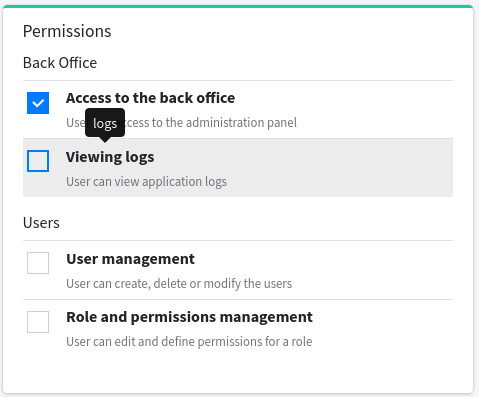

# Use roles and permissions

Roles and permissions are supported by the package [santigarcor/laratrust](https://laratrust.santigarcor.me/). Please read his documentation.

The permissions are intimately linked to the code of your project. Indeed, permissions are found in routes, middlewares or controllers.

It is important to understand how roles, permission categories and permissions are structured.

A user can have none, one or multiple roles and a role can have none, one or multiple permissions. In case of multiple roles one one user, the permissions are cumulated.

---

## Roles

Roles are groups of permissions, they can be created and managed in the back-office.

By default two roles are available : 

`admin` : all permissions by default, the first user will automatically have this role. This role cannot be deleted. 

`backend_user` : can only access to the back-office and nothing else by default. You can add permissions to this role for your backend users if needed or delete this role.

To create a new role, just click on the button `Add a role` above the role list.

---

## Permissions

When editing a role, you can define one or multiple permissions. 



Permission name can be found when you move the mouse over the permission label. This name is required to check if the current user is allowed or not to do the action.

### Check permissions

There is several ways to check permissions.

With [Laratrust middleware](https://laratrust.santigarcor.me/docs/6.x/usage/middleware.html#configuration) on **routes** :

```php
Route::group(['prefix' => 'admin', 'middleware' => ['ability:admin,backend_access']], function() {
    Route::get('/', 'AdminController@welcome');
    Route::get('/manage', ['middleware' => ['permission:manage-admins'], 'uses' => 'AdminController@manageAdmins']);
});
```

With [Laratrust middleware](https://laratrust.santigarcor.me/docs/6.x/usage/middleware.html#configuration) in **controller** constructor :

```php
public function __construct()
{
   $this->middleware('ability:admin,backend_access', [
       'except' => [
           'show',
       ],
   ]);
}
```

[In **Blade** templates](https://laratrust.santigarcor.me/docs/6.x/usage/blade-templates.html)

```html
@role('admin')
    <p>This is visible to users with the admin role. Gets translated to
    \Laratrust::hasRole('admin')</p>
@endrole

@permission('manage-admins')
    <p>This is visible to users with the given permissions. Gets translated to
    \Laratrust::isAbleTo('manage-admins'). The @can directive is already taken by core
    laravel authorization package, hence the @permission directive instead.</p>
@endpermission

@ability('admin,owner', 'create-post,edit-user')
    <p>This is visible to users with the given abilities. Gets translated to
    \Laratrust::ability('admin,owner', 'create-post,edit-user')</p>
@endability
```

[Or check directly in your **code**](https://laratrust.santigarcor.me/docs/6.x/usage/roles-and-permissions.html#user-ability) :

```php
Laratrust::hasRole('role-name');
Laratrust::isAbleTo('permission-name');
Laratrust::ability('admin|owner', 'create-post|edit-user');

// is identical to
Auth::user()->hasRole('role-name');
Auth::user()->hasPermission('permission-name');
Auth::user()->ability('admin|owner', 'create-post|edit-user');
```

### Create permissions

To add one or more permissions to your project, you will have to use migrations so that they cannot be modified in the back office and can be delivered with your project or package.

An artisan command is available to generate the migration file :

```
php artisan boilerplate:permission
```

The command will ask you to answer several questions :

```
Name of the permission to create (snake_case):
```

The first question asks you to set the name of the permission. 
This is the most important value because this is how you the permission will be called in your checks.  

```
 Full name of the permission (can be a locale string):
``` 

The name of the permission used in the back-office (the bold text in the list). This can be a locale string. 

```
 Full description of the permission (can be a locale string):
```

The description of the permission used in the back-office (the small text in the list). This can be a locale string.

```
 Create or assign to a permissions group ? (yes/no) [no]:
```

Answer `yes` if you want to group the permissions in one category. If you answers `no`, the permission will go in the `Back Office` group.

```
 Permissions groups:
  [0] Create a new group
  [1] users
```

If you answers `yes`, you will able to create a new group or assign to an existant one.

```
 Name of the group (snake_case):
```

If you answers `0` (create a new group), you have to define the group name.

```
 Full name of the group (can be a locale string):
```

And finally, define the group label. This can be a locale string.